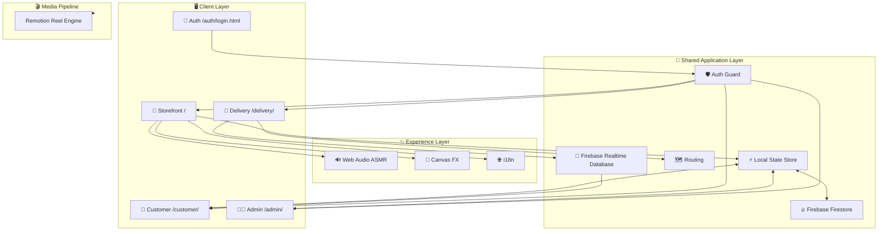
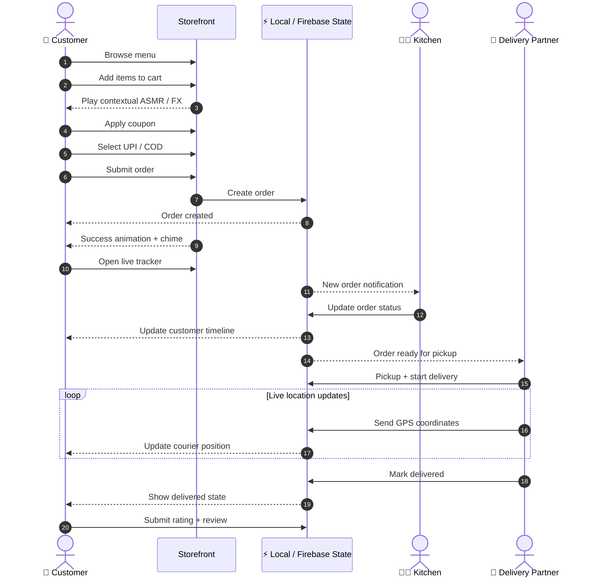

# 🥟 Glory Momo

> **A next-generation Bengali street-food ordering experience inspired by the momo stalls of Darjeeling and Kolkata.**

Glory Momo is a sensory-first, multi-role food-ordering web application that combines a storefront, live order tracking, kitchen operations, delivery GPS tracking, procedural Web Audio effects, interactive Canvas visuals, multilingual UI, and a programmatic social-media reel pipeline.

The project is designed around one idea: **food ordering should feel like an experience, not a checkout form.**

---

## ✨ What Makes Glory Momo Different

| Capability | What it does |
|---|---|
| 🔊 **Procedural ASMR Audio** | Generates crunches, steam, sizzling oil, flame, broth pours, and success chimes entirely with the Web Audio API. |
| 🎨 **Interactive Culinary FX** | Uses HTML5 Canvas particles for steam, embers, flames, and interaction-driven visual effects. |
| 🛒 **Customer Storefront** | Menu browsing, cart management, coupons, multilingual support, and UPI/COD checkout. |
| 📍 **Live Order Tracking** | Milestone-based order progress with a Leaflet map and live delivery location. |
| 👨‍🍳 **Kitchen Dashboard** | Real-time order queue with fast status transitions and new-order audio alerts. |
| 🛵 **Delivery Portal** | Pickup, delivery-status updates, GPS broadcasting, and road navigation. |
| 🌐 **Multilingual UI** | English, Hindi, and Bengali support. |
| ⚡ **Resilient State Layer** | Immediate local UI state with asynchronous Firebase synchronization. |
| 🎬 **Remotion Reel Engine** | Programmatic 1080×1920, 60fps vertical promotional-video composition. |

---

# 🧭 Application Overview

Glory Momo is split into **four operational portals**, supported by a shared authentication layer and reusable application modules.

### 1. 🛒 Customer Storefront
`/`

The primary ordering experience.

- Interactive food menu
- Dynamic cart
- Coupon handling
- English / Hindi / Bengali UI
- UPI and Cash on Delivery checkout
- Context-aware ASMR sounds
- Culinary Canvas effects
- Order creation and redirect to live tracking

### 2. 📱 Customer Order Tracker
`/customer/`

The post-checkout experience.

- Live order status
- Delivery milestone timeline
- Leaflet map
- Courier location updates
- Route preview
- Review and rating submission

### 3. 👨‍🍳 Kitchen Admin
`/admin/`

The operational control center.

- Incoming order queue
- Order filtering
- One-click status transitions
- New-order audio notifications
- Preparation and ready-state management

### 4. 🛵 Delivery Partner
`/delivery/`

The final-mile delivery interface.

- Ready-for-pickup orders
- Pickup and delivery status controls
- Browser geolocation
- Live GPS broadcasting
- Road navigation
- Delivery completion

---

# 🏗️ Architecture



### Data responsibilities

**Firestore**
- Orders
- Users
- Reviews
- Application state that needs persistent remote synchronization

**Realtime Database**
- Live courier GPS coordinates

**Local browser state**
- Immediate UI reactions
- Local event/state synchronization
- Non-blocking remote persistence

This split keeps interactions responsive while allowing operational portals to receive state updates without making every UI action wait on a remote request.

---

# 🔄 Order Lifecycle



---

# 🔊 Procedural ASMR Engine

**File:** `shared/audio-synth.js`

The audio layer deliberately avoids packaged MP3/WAV assets. Sounds are synthesized at runtime using browser-native Web Audio primitives.

### Sound mapping

| Interaction | Function | Synthesis concept |
|---|---|---|
| 🍘 Crispy / Kurkure | `playCrunchSound()` | Layered granular noise bursts with randomized high-Q band-pass filtering |
| ♨️ Steamed / Sizzled | `playSteamHissSound()` | High-pressure noise sweep with resonant frequency movement |
| 🔥 Tandoori / Flame / Tadka | `playTadkaFlameSound()` | Low-frequency rumble combined with crackle-like components |
| 🍲 Jhol / Broth | `playJholPourSound()` | Descending liquid resonance with harmonic droplet pops |
| ➖ Remove item | `playItemRemove()` | Downward dual-tone suction/pop |
| ✅ Checkout / Coupon / Success | `playDoodleSwooshSound()` | Pentatonic arpeggio with an airy noise tail |

### Why procedural audio?

- No audio asset downloads
- Small implementation footprint
- Dynamic sound generation
- Easy mapping between UI interactions and sound behavior
- Consistent experience across the application

---

# 🎨 Interactive Culinary Canvas

**File:** `shared/canvas-fx.js`

The visual layer uses HTML5 Canvas to create lightweight food-inspired effects such as:

- Steam particles
- Ember sparks
- Flame bursts
- Interaction-triggered particle events

These effects complement the procedural audio system so interactions have both an **auditory and visual response**.

---

# 🌐 Multilingual Experience

**File:** `shared/i18n.js`

The interface supports:

- 🇬🇧 English
- 🇮🇳 Hindi
- বাংলা Bengali

The translation layer is shared across the application rather than duplicating UI text independently inside each portal.

---

# 🗺️ Live Delivery Tracking

The delivery workflow combines browser geolocation, Firebase Realtime Database, Leaflet mapping, and road-routing functionality.

```text
Delivery Browser
      │
      │ GPS coordinates
      ▼
Firebase Realtime Database
      │
      │ Live snapshot
      ▼
Customer Tracker
      │
      ├── Courier marker
      ├── Delivery route
      └── Order milestone
```

The delivery portal can broadcast the courier's current latitude/longitude while the customer tracker consumes those updates.

---

# 📁 Project Structure

```text
glory-momo/
│
├── index.html                  # Customer storefront
├── script.js                   # Catalog, cart & interaction logic
├── styles.css                  # Core design system & animations
├── pay.js                      # Checkout, UPI modal & QR generation
├── firebase-config.js          # Firebase initialization
│
├── admin/
│   ├── index.html              # Kitchen dashboard
│   ├── admin.js                # Queue & status management
│   └── admin.css               # Admin interface styling
│
├── customer/
│   ├── index.html              # Live order tracker
│   ├── customer.js             # Tracking & review logic
│   └── customer.css            # Tracker styling
│
├── delivery/
│   ├── index.html              # Delivery dashboard
│   ├── delivery.js             # GPS & navigation logic
│   └── delivery.css            # Delivery interface styling
│
├── auth/
│   ├── login.html              # Authentication interface
│   ├── login.js                # Authentication controller
│   └── login.css               # Authentication styling
│
├── shared/
│   ├── audio-synth.js          # Procedural Web Audio engine
│   ├── canvas-fx.js            # Steam / ember / flame effects
│   ├── firestore.js            # Local + Firestore state layer
│   ├── auth-guard.js           # Role-based route protection
│   ├── i18n.js                 # EN / HI / BN translations
│   ├── routing.js              # Road-routing functionality
│   └── motion.js               # Motion & particle utilities
│
├── remotion/
│   ├── GloryMomoReel.tsx       # Vertical reel composition
│   ├── Root.tsx                # Remotion registry
│   └── index.ts                # Remotion entrypoint
│
└── LICENSE
```

---

# 🚀 Getting Started

## Prerequisites

Install:

- **Node.js 18+**
- **npm** or **pnpm**

Verify your environment:

```bash
node --version
npm --version
```

## 1. Clone the repository

```bash
git clone https://github.com/your-username/glory-momo.git
cd glory-momo
```

> Replace the repository URL with the actual GitHub repository before publishing this README.

## 2. Install dependencies

```bash
npm install
```

## 3. Start the development server

```bash
npm run dev
```

The application is expected to be available at:

```text
http://localhost:5173/
```

---

# 🔐 Demo Roles

The project includes demo credentials for testing the different application roles.

| Role | Email | Password | Portal |
|---|---|---|---|
| 🛒 Customer | `customer@glorymomo.com` | `customer123` | `/` |
| 👨‍🍳 Kitchen Admin | `admin@glorymomo.com` | `admin123` | `/admin/` |
| 🛵 Delivery Partner | `delivery@glorymomo.com` | `delivery123` | `/delivery/` |

Authentication can also be accessed through:

```text
/auth/login.html
```

### ⚠️ Security note

These credentials are intended for local/demo usage. **Do not ship demo passwords or hard-coded credentials into a production deployment.**

---

# 🛠️ Production Build

Create an optimized build:

```bash
npm run build
```

Preview the production build locally:

```bash
npm run preview
```

Before deployment, verify:

- Firebase configuration
- Authentication rules
- Firestore security rules
- Realtime Database rules
- Production credentials
- Geolocation permissions
- Map/routing dependencies
- Payment workflow
- Error handling and observability

---

# 🧪 Development & Testing

The application architecture is intended to support testing around:

- Customer ordering
- Coupon behavior
- Order state transitions
- Role-based access
- Delivery location updates
- Customer tracking
- Review submission
- Firebase synchronization
- Audio/visual interaction triggers

For production-grade deployment, remote state, authentication, and authorization rules should be tested independently from the UI.

---

# 🧩 Core Technologies

| Technology | Purpose |
|---|---|
| **HTML5 / CSS3 / JavaScript** | Core application UI and behavior |
| **Web Audio API** | Procedural ASMR sound generation |
| **HTML5 Canvas** | Culinary particle effects |
| **Firebase Firestore** | Persistent application data |
| **Firebase Realtime Database** | Live GPS synchronization |
| **Leaflet** | Interactive maps |
| **OSRM** | Road-routing functionality |
| **Remotion** | Programmatic promotional video |
| **Node.js / npm** | Development and build tooling |

---

# 🎯 Design Philosophy

Glory Momo is built around five principles:

### 01 — Make interactions tangible
Buttons should not feel like dead rectangles. Ordering food should have feedback.

### 02 — Keep the UI responsive
Local state provides immediate feedback while remote synchronization happens asynchronously.

### 03 — Separate operational roles
Customers, kitchen staff, and delivery partners have different jobs, so they get different interfaces.

### 04 — Reuse shared infrastructure
Audio, motion, authentication, routing, localization, and state logic live in shared modules instead of being reinvented in every portal.

### 05 — Build for the complete journey
The experience does not stop at checkout:

```text
Discover
   ↓
Choose
   ↓
Customize
   ↓
Order
   ↓
Prepare
   ↓
Pickup
   ↓
Deliver
   ↓
Review
```

---

# 📊 Application Flow at a Glance

```text
                         ┌──────────────────┐
                         │     CUSTOMER     │
                         └────────┬─────────┘
                                  │
                                  ▼
                         ┌──────────────────┐
                         │    STOREFRONT    │
                         │       /          │
                         └────────┬─────────┘
                                  │
                             Place Order
                                  │
                                  ▼
                         ┌──────────────────┐
                         │   STATE LAYER    │
                         │ Local + Firebase │
                         └───────┬───┬──────┘
                                 │   │
                    ┌────────────┘   └────────────┐
                    ▼                             ▼
           ┌────────────────┐             ┌────────────────┐
           │ KITCHEN /admin │             │ /customer      │
           │ Prepare Order  │             │ Track Order    │
           └───────┬────────┘             └───────▲────────┘
                   │                              │
               Ready                              │ GPS
                   │                              │
                   ▼                              │
           ┌────────────────┐                      │
           │ DELIVERY       │──────────────────────┘
           │ /delivery      │
           └───────┬────────┘
                   │
                Delivered
                   │
                   ▼
           ┌────────────────┐
           │ Review / Rating│
           └────────────────┘
```

---

# 🧱 Future Hardening Checklist

Before treating the project as production-ready, the following areas deserve explicit verification:

- [ ] Replace demo authentication credentials
- [ ] Lock down Firebase security rules
- [ ] Validate all client-provided order values server-side
- [ ] Validate coupon eligibility server-side
- [ ] Prevent unauthorized role switching
- [ ] Protect admin and delivery routes
- [ ] Add robust error and retry handling
- [ ] Validate GPS input and stale-location behavior
- [ ] Add automated tests for order-state transitions
- [ ] Add production observability and crash reporting
- [ ] Configure real production payment handling
- [ ] Review third-party map/routing usage limits
- [ ] Verify accessibility and mobile responsiveness
- [ ] Add environment-specific configuration
- [ ] Remove development-only shortcuts before deployment

---

# 📜 License

Distributed under the **MIT License**.

See [`LICENSE`](LICENSE) for the complete license text.

---

## 🥟 Built for the Love of Momos

**Glory Momo** turns a familiar food-ordering workflow into a full sensory product experience, connecting customers, kitchen operations, and delivery logistics through one shared application architecture.

> **Steam. Spice. Sound. Motion. Delivery.**
>
> That's the whole momo journey.
